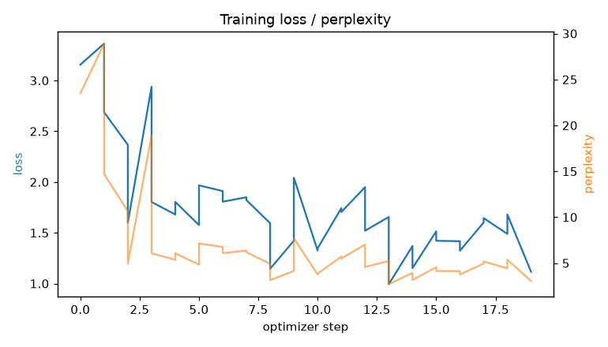
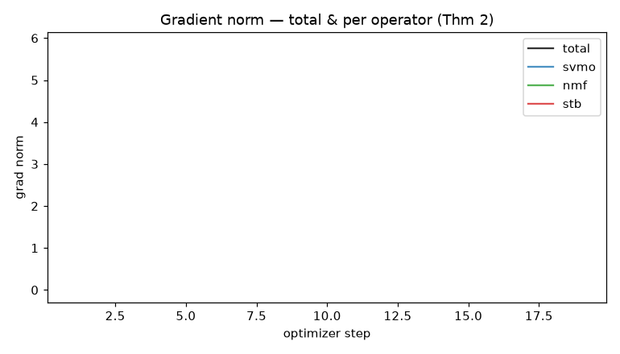
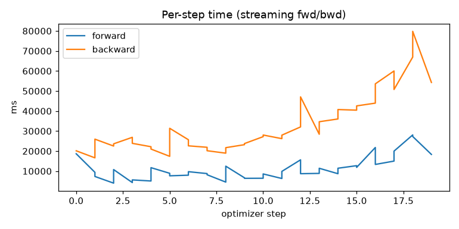
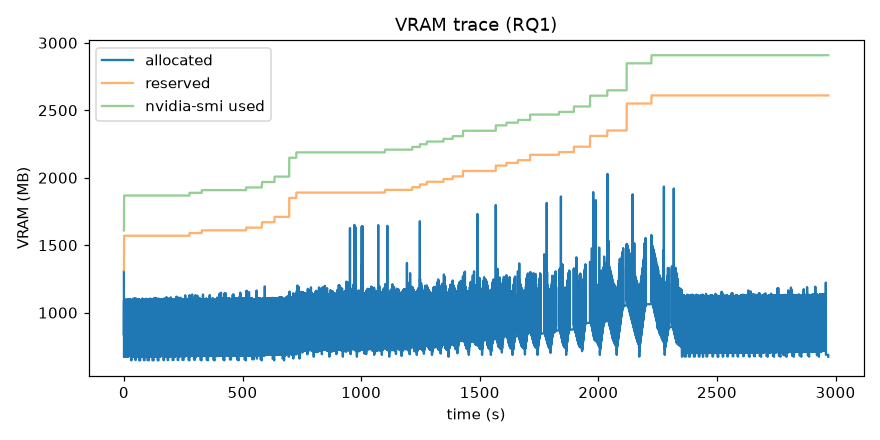
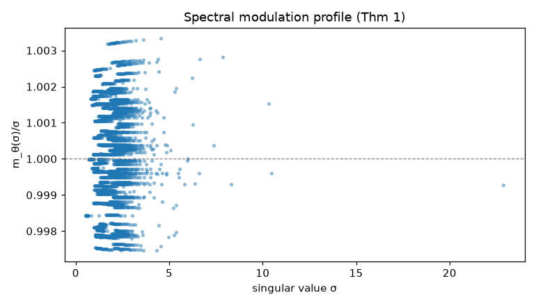

# S³ Training Report

_generated 2026-07-19T03:33:15.454975+00:00_

## Headline

- **Model**: Qwen/Qwen2.5-7B-Instruct
- **GPU**: NVIDIA GeForce GTX 1050 (3.94 GB)
- **Trainable params**: 3,437,700 (0.0451% of 7,619,054,212)
- **VRAM peak**: 2028.3 MB
- **Throughput**: 6.06 tok/s
- **Total wall-clock**: 27.96 min

## Quality (RQ2 gate — did it learn?)

| metric | base (init) | after | Δ |
|---|---|---|---|
| eval_loss | 2.25348 | 1.62421 | -0.6293 |
| perplexity | 9.5208 | 5.0744 | -4.4464 |

## Training dynamics

- optimizer steps: 38
- loss: first 3.1567 → last 1.1155 (min 0.9932)
- fp16 steps skipped by GradScaler (overflow warmup): 0
- mean grad_svmo: 0.1191
- mean grad_nmf: 0.955
- mean grad_stb: 0

## Memory (RQ1)

- VRAM allocated: peak 2028 MB, median 861 MB
- CPU RAM: peak 13888 MB
- samples: 21822 @ ~100ms

## Provenance & config

```json
{
  "versions": {
    "torch": "2.5.1+cu121",
    "transformers": "5.13.0",
    "accelerate": "1.14.0",
    "safetensors": "0.8.0",
    "bitsandbytes": "0.49.2",
    "datasets": "5.0.0",
    "numpy": "2.5.0"
  },
  "hardware": {
    "gpu": {
      "name": "NVIDIA GeForce GTX 1050",
      "total_vram_gb": 3.94,
      "driver_cuda": "12.1"
    },
    "cpu_count": 8,
    "ram_total_gb": 15.5,
    "platform": "Linux-6.18.7-76061807-generic-x86_64-with-glibc2.39"
  },
  "params": {
    "total": 7619054212,
    "trainable": 3437700,
    "trainable_pct": 0.0451,
    "by_component": {
      "svmo": 225988,
      "nmf": 3211712,
      "stb": 3211712,
      "lora": 0
    }
  },
  "git": "d1be1682af63e6e461496f01cb1f4c24c32568fb"
}
```

## Figures

### loss_curve.png


### lr.png


### grad_norms.png


### step_time.png


### vram_trace.png


### layer_grads.png


### modulation.png


## Raw data (regenerate any plot)

- `steps.csv`
- `vram_trace.csv`
- `layer_grads.csv`
- `modulation.csv`
- `provenance.json`
- `summary.json`

## Still needed for the paper (not auto-collected here)

- Downstream benchmarks: MMLU / HellaSwag / ARC / GSM8K / AlpacaEval (need datasets cached; run `make evaluate`).
- Baselines: LoRA r=8/r=64, QLoRA, full-FT (same seeds/eval).
- Ablations: −STB / −NMF / −SVMO and single-operator runs.
- n≥3 seeds → mean ± std / 95% CI.