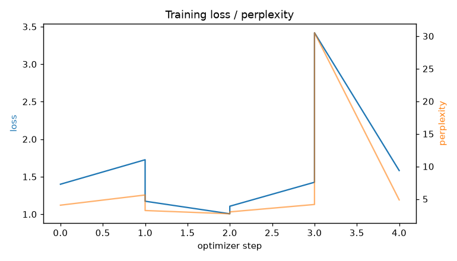
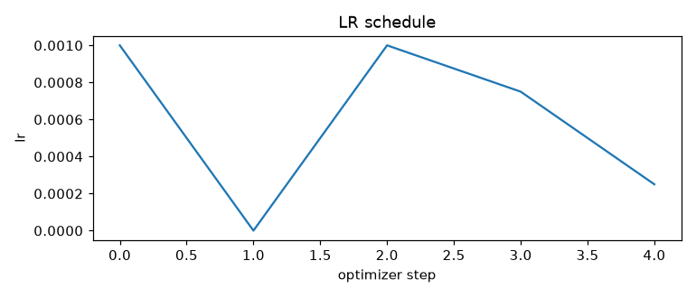
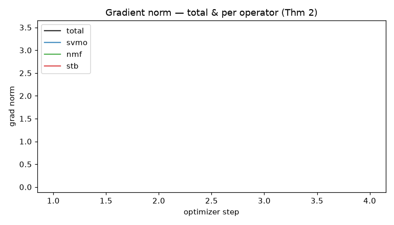
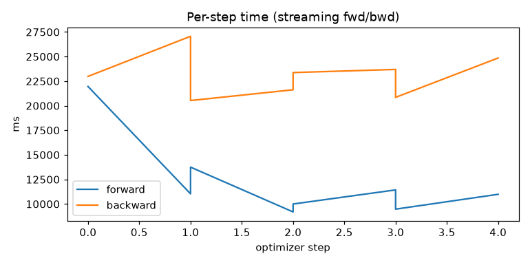
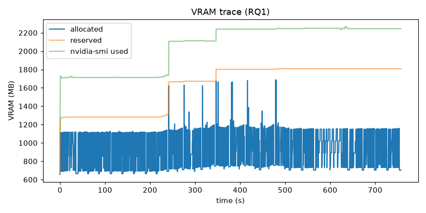
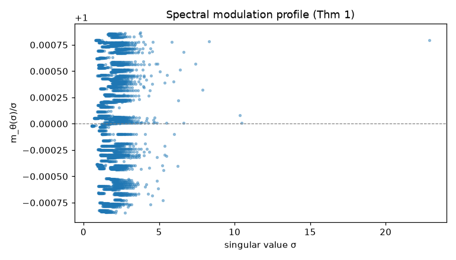

# S³ Training Report

_generated 2026-07-15T02:18:37.192383+00:00_

## Headline

- **Model**: Qwen/Qwen2.5-7B-Instruct
- **GPU**: NVIDIA GeForce GTX 1050 (3.94 GB)
- **Trainable params**: 3,896,452 (0.0511% of 7,619,512,964)
- **VRAM peak**: 1688.6 MB
- **Throughput**: 1.85 tok/s
- **Total wall-clock**: 4.73 min

## Quality (RQ2 gate — did it learn?)

| metric | base (init) | after | Δ |
|---|---|---|---|
| eval_loss | 2.48387 | 1.95325 | -0.5306 |
| perplexity | 11.9876 | 7.0516 | -4.936 |

## Training dynamics

- optimizer steps: 8
- loss: first 1.3997 → last 1.5822 (min 1.0059)
- fp16 steps skipped by GradScaler (overflow warmup): 0
- mean grad_svmo: 0.1771
- mean grad_nmf: 1.792
- mean grad_stb: 0.1062

## Memory (RQ1)

- VRAM allocated: peak 1689 MB, median 901 MB
- CPU RAM: peak 13198 MB
- samples: 5207 @ ~100ms

## Provenance & config

```json
{
  "versions": {
    "torch": "2.5.1+cu121",
    "transformers": "5.13.0",
    "accelerate": "1.14.0",
    "safetensors": "0.8.0",
    "bitsandbytes": "0.49.2",
    "datasets": "5.0.0",
    "numpy": "2.5.0"
  },
  "hardware": {
    "gpu": {
      "name": "NVIDIA GeForce GTX 1050",
      "total_vram_gb": 3.94,
      "driver_cuda": "12.1"
    },
    "cpu_count": 8,
    "ram_total_gb": 15.5,
    "platform": "Linux-6.18.7-76061807-generic-x86_64-with-glibc2.39"
  },
  "params": {
    "total": 7619512964,
    "trainable": 3896452,
    "trainable_pct": 0.0511,
    "by_component": {
      "svmo": 225988,
      "nmf": 3211712,
      "stb": 3670464
    }
  },
  "git": "f970a614a37c3c27a390323cfedce21ec51d5264"
}
```

## Figures

### loss_curve.png


### lr.png


### grad_norms.png


### step_time.png


### vram_trace.png


### modulation.png


## Raw data (regenerate any plot)

- `steps.csv`
- `vram_trace.csv`
- `layer_grads.csv`
- `modulation.csv`
- `provenance.json`
- `summary.json`

## Still needed for the paper (not auto-collected here)

- Downstream benchmarks: MMLU / HellaSwag / ARC / GSM8K / AlpacaEval (need datasets cached; run `make evaluate`).
- Baselines: LoRA r=8/r=64, QLoRA, full-FT (same seeds/eval).
- Ablations: −STB / −NMF / −SVMO and single-operator runs.
- n≥3 seeds → mean ± std / 95% CI.